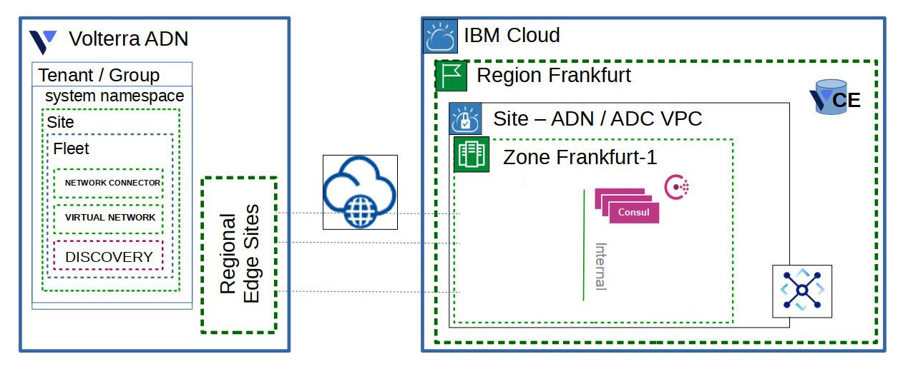

# Consul Cluster in Existing VPC

This Schematics Workspace module lifecycle manages:

- Votlerra Discovery for Consul VSIs

The application of this Workspace module results in the creation of a Consul cluster connected to the designated IBM VPC subnets.

## Variables values

You will have to define the following variables:

| Key | Definition | Required/Optional | Default Value |
| --- | ---------- | ----------------- | ------------- |
| `ibm_resource_group` | The resource group to create the VPC and VSIs | optional | default |
| `ibm_region` | The IBM Cloud region to create the VPC | optional | us-south |
| `ibm_zone` | The zone number within the region to create the VPC | optional | 1 |
| `ibm_profile` | The IBM VPC profile to use for the CE instances | optional | cx2-4x8 |
| `ibm_ssh_key_name` | The name of the IBM stored SSH key to inject into VSIs | required |  |
| `ibm_subnet_id` | The IBM VPC subnet ID for the Consul cluster | required |  |
| `ibm_security_group_id` | The IBM VPC subnet group ID for the Consul Cluster | optional | default VPC security group |
| `consul_cluster_size` | The number of Consul servers in the cluster | optional | 3 |
| `consul_organization` | The organization string to use in the Consul certs | required | |
| `consul_datacenter` | The datacenter string to us in the Consul certs | required | |
| `consul_client_token` | The client token to use for the cluster | optional | auto-generated uuid |
