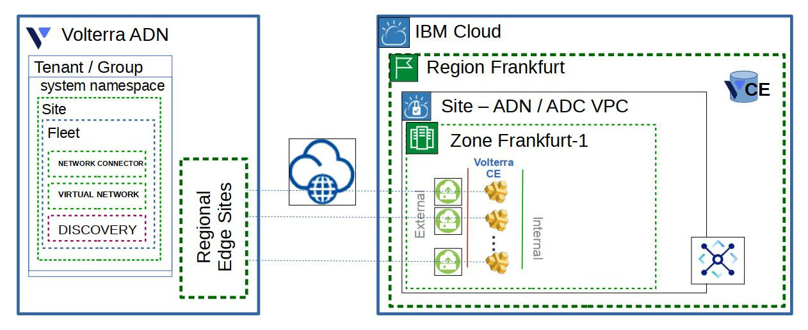

# Creating Volterra CE Site in an Existing VPC

This Schematics Workspace module lifecycle manages:

- Volterra CE VSI
- Volterra Site
- Volterra Fleet
- Volterra Network Connector to the global shared/public network
- Volterra Virtual Network exporting routes to IBM Transit Gateway networks
- Votlerra Discovery for Consul VSIs

The application of this Workspace module results in the creation of a Volterra CE cluster connected to the designated IBM VPC subnets.

## Variables values

You will have to define the following variables:

| Key | Definition | Required/Optional | Default Value |
| --- | ---------- | ----------------- | ------------- |
| `ibm_resource_group` | The resource group to create the VPC and VSIs | optional | default |
| `ibm_region` | The IBM Cloud region to create the VPC | optional | us-south |
| `ibm_zone` | The zone number within the region to create the VPC | optional | 1 |
| `ibm_profile` | The IBM VPC profile to use for the CE instances | optional | cx2-4x8 |
| `ibm_ssh_key_name` | The name of the IBM stored SSH key to inject into VSIs | required |  |
| `ibm_outside_subnet_id` | The IBM VPC subnet ID for the external interface of the CE | required |  |
| `ibm_outside_security_group_id` | The IBM VPC subnet group ID for the external interface of the CE | optional | default VPC security group |
| `ibm_inside_subnet_id` | The IBM VPC subnet ID for the internal interface of the CE | required |  |
| `ibm_inside_security_group_id` | The IBM VPC subnet group ID for the internal interface of the CE | optional | default VPC security group |
| `ibm_inside_gateway` | The inside subnet IP address to route all internal networks through | optional | first CIDR address available in the inside subnet |
| `ibm_internal_networks` | List of HCL object defining IPv4 CIDRs (cidr attribute) and IPv4 gateway (gw attribute) to connect via the CE VSIs | optional | [] |
| `volterra_cluster_size` | The number of Volterra CE instances in the site cluster | optional | 3 |
| `volterra_download_region` | The IBM COS region to download the custom images | optional | us-south |
| `volterra_ce_version` | The Volterra version to download from the F5 COS catalog | optional | 7.2009.5 |
| `volterra_tenant_name` | The Volterra tenant (group) name | required | |
| `volterra_site_name` | The Volterra site name to create for this cluster | required | |
| `volterra_fleet_label` | The Volterra fleet label to create | optional | site name with '-fleet' |
| `volterra_api_token` | The Volterra API token used to manage Volterra resources | required | |
| `volterra_admin_password` | The admin user password for the CE instances | optional | randomized string |
| `volterra_ssl_tunnels` | Allow SSL tunnels to connect the Volterra CE to the RE | optional | false |
| `volterra_ipsec_tunnels` | Allow IPSEC tunnels to connect the Volterra CE to the RE | optional | true |
| `consul_ca_cert` | The CA certificate to register Consul service discovery | optional | cx2-4x8 |
| `consul_https_servers` | List of the Consul servers to register with Consul service discovery | optional | [] |
